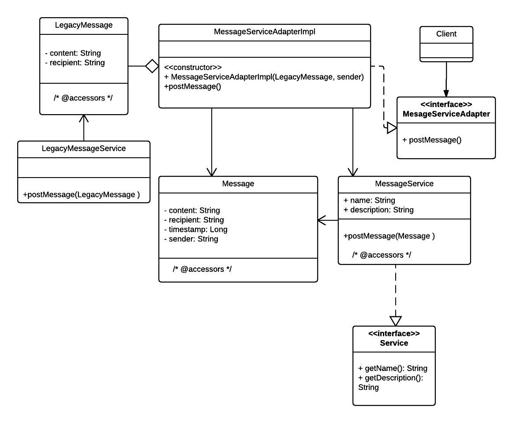

### Adapter Design Pattern

#### A structural pattern

How to make two unrelated interfaces work together.

In this example we suppose the need to adapt from a legacy message posting service to a new world, more elaborated message posting service.

Source code stems from the following UML diagram:

